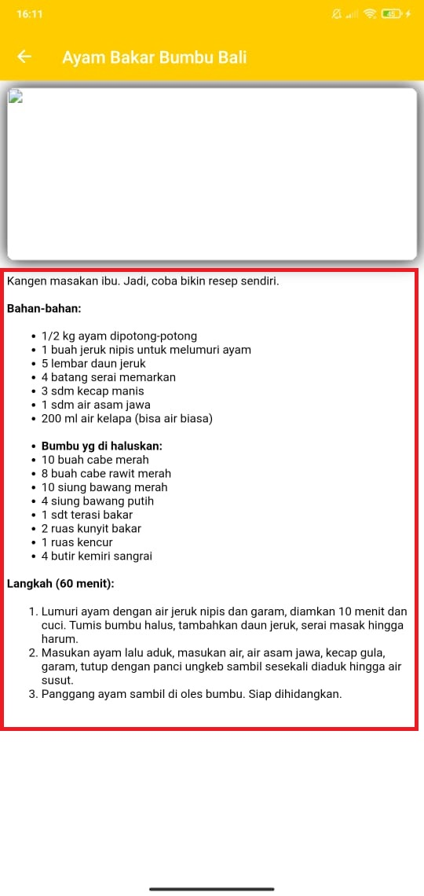
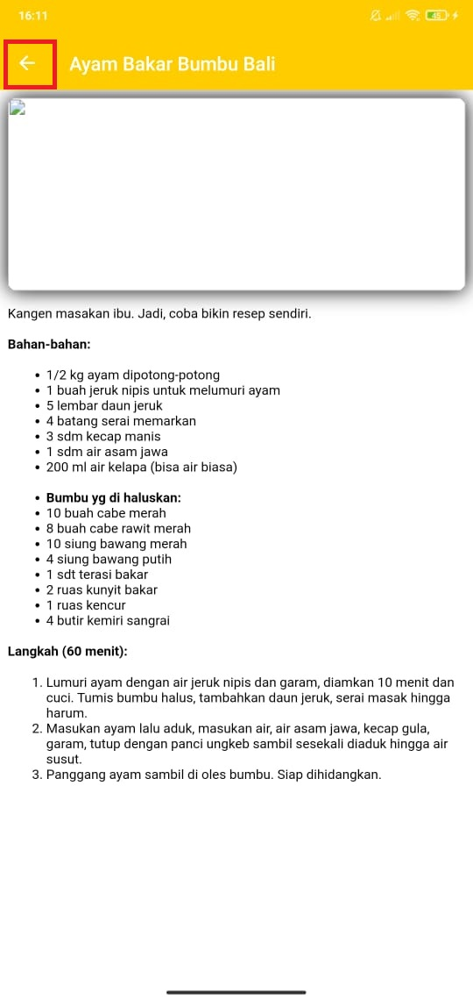

# 00 - Project

## Pertanyaan

1. Implementasikan materi/pertemuan sebelumnya tentang data binding, fragment, navigation, dan ViewModel pada ide project akhir Anda! (minimal 1 fitur tiap materi tersebut) Cantumkan tautan github Anda yang tertuju pada file markdown (.md) berisi screenshot tiap fitur tersebut.

2. Jelaskan perbedaan Data Binding dan ViewModel ? lalu pada saat kapan harus menggunakan Data Binding dan ViewModel ? (Mohon cantumkan referensinya).

3. Jelaskan perbedaan fragment dan Activity ? lalu pada saat kapan harus menggunakan fragment dan Activity ? (Mohon cantumkan referensinya).

## Jawaban

1. #### Fragment

#### Navigation

2. #### Data Binding
Data Binding adalah proses membangun koneksi antarmuka aplikasi (application UI) dan business logic. Data binding membuat kontrol-kontrol dalam form terkoneski (terkait) dengan sumber-sumber data.

sumber : https://medium.com/gits-indonesia/android-data-binding-7edf75b16067

#### ViewModel
ViewModel sebagai objek yang akan selalu ada sampai komponen seperti activity di destroy. Berguna untuk menyimpan data sementara agar tidak hilang.

sumber : https://medium.com/@wisnukurniawan/tutorial-android-architecture-room-livedata-viewmodel-e8f7b73e2d00

3. #### Fragment
Fragment adalah sebuah reuseable class yang mengimplement beberapa fitur sebuah Activity. Fragment biasanya dibuat sebagai bagian dari suatu antarmuka. Sebuah fragment harus berada di dalam sebuah activity, mereka tidak dapat berjalan sendiri tanpa adanya activity tempat mereka menempel.

sumber : https://www.codepolitan.com/membuat-dan-menggunakan-fragment-59f80eff061a4

#### Activity
Activity merupakan salah satu komponen yang ada di Android Studio yang berfungsi untuk menampilkan user interface (UI) dari aplikasi yang akan dibuat, biasanya diletakkan pada “setcontentview”. Bukan hanya menampilkan UI, activity juga digunakan untuk melakukan berbagai kegiatan yang diperlukan di dalam aplikasi tersebut seperti berpindah dari satu tampilan ke tampilan lainnya, menjalankan program lain, dan masih banyak lagi yang dapat dilakukan di dalam sebuah activity. 

Sumber : https://socs.binus.ac.id/2017/09/26/activity-dan-fragment-di-android-studio/#:~:text=Activity%20merupakan%20salah%20satu%20komponen,yang%20diperlukan%20di%20dalam%20aplikasi