# 02 - Layout

## Tujuan Pembelajaran

1. Mahasiswa memahami konsep layout pada android.
2. Mahasiswa memahami konsep View Group dan Hierarchy pada layout
3. Mahasiswa mampu membuat layout sederhana
4. Mahasiswa menguasai layout editor dan kegunaannya pada android studio.

## Hasil Praktikum

##### 1.Task A1X.01

##### 2.Task A1X.02

##### 3.Task A1X.03
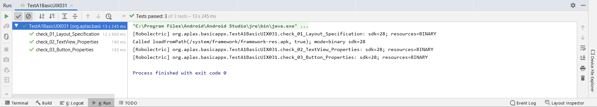

##### 4.Task A1X.04
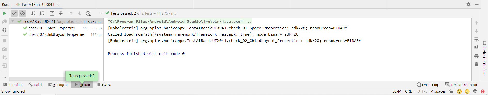

##### 5.Task A1X.05
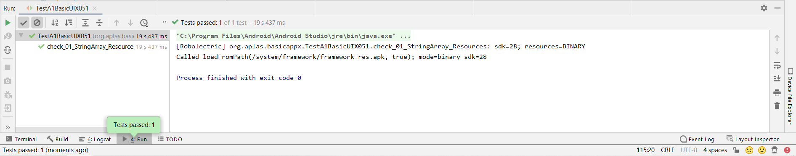
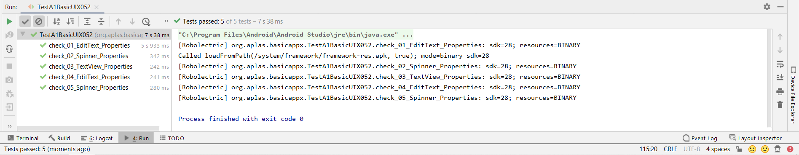

##### 6.Task A1X.06
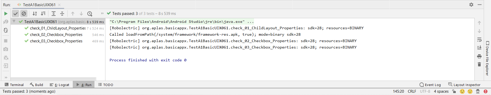

##### 7.Task A1X.07
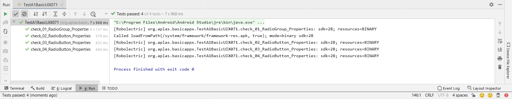

##### 8.Task A1X.08
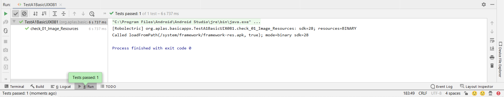
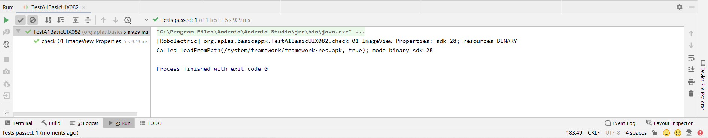

##### 9.Task A1X.09
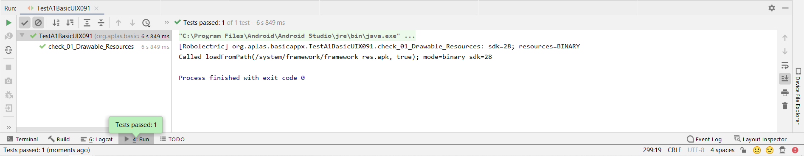
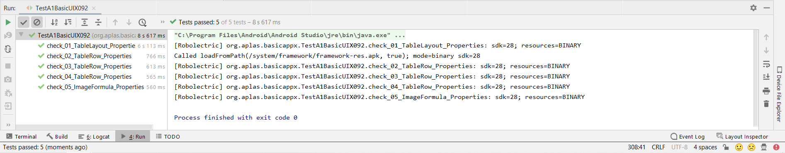

10.Tampilan Layout 
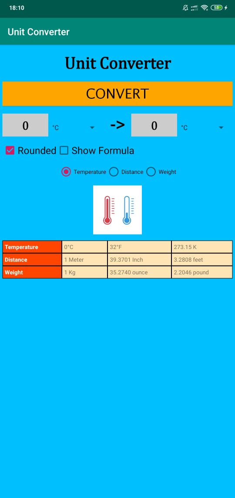

