# 03 - Basic Activity

## Tujuan Pembelajaran

1. Mahasiswa mampu melakukan pengujian, debugging, dan menggunakan pustaka dukungan.
2. Mahasiswa mampu memodifikasi program converter sederhana menjadi aplikasi yang layak digunakan.

## Hasil Praktikum

##### 1.Task B1X.01

##### 2.Task B1X.02
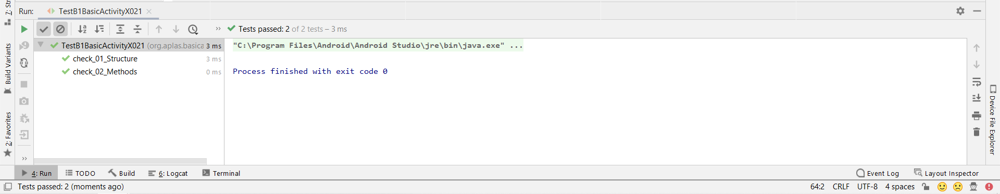

##### 3.Task B1X.03
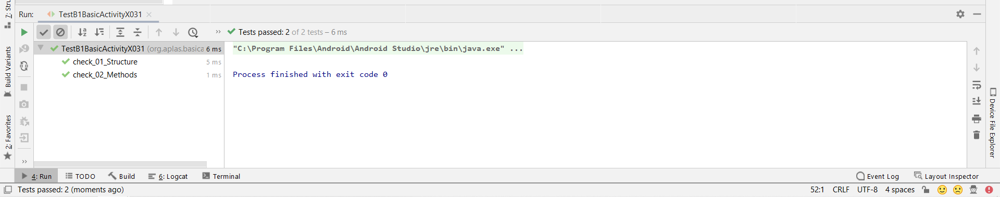

##### 4.Task B1X.04
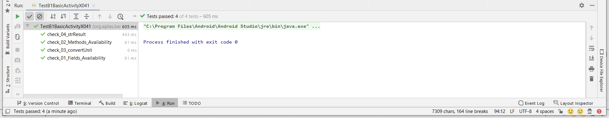

##### 5.Task B1X.05
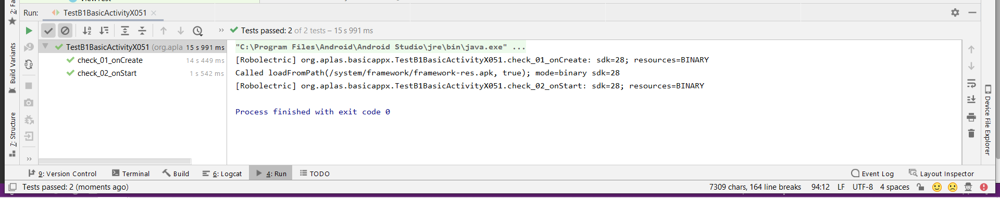

##### 6.Task B1X.06
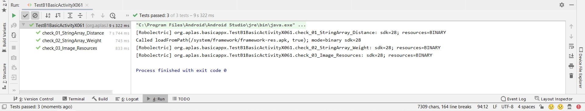
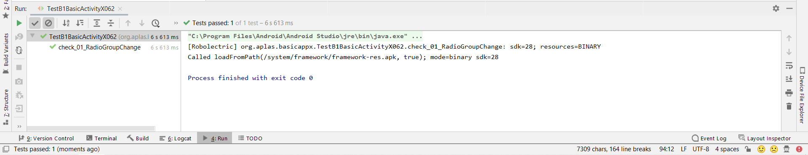

##### 7.Task B1X.07
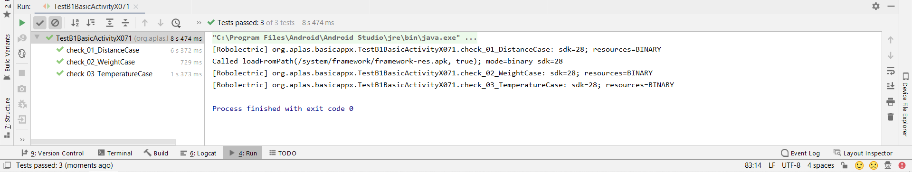

##### 8.Task B1X.08
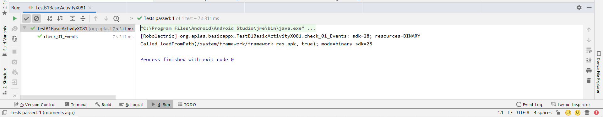

##### 9.Task B1X.09
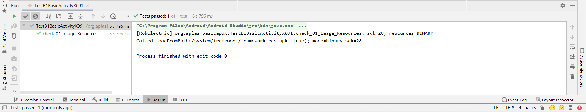
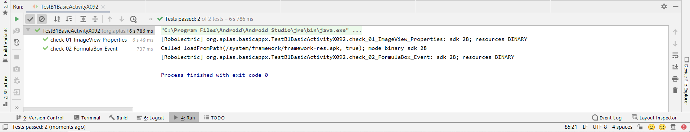

##### 10. Hasil run Temperature
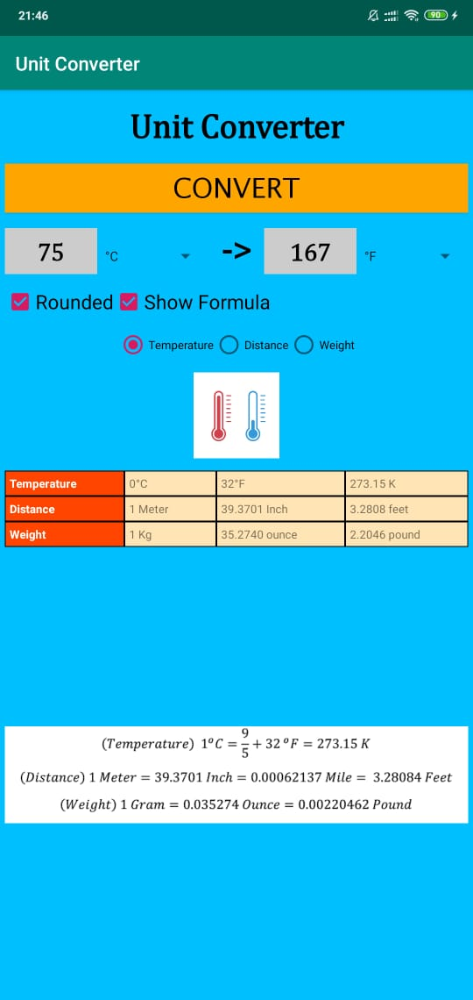

##### 11. Hasil run Weight
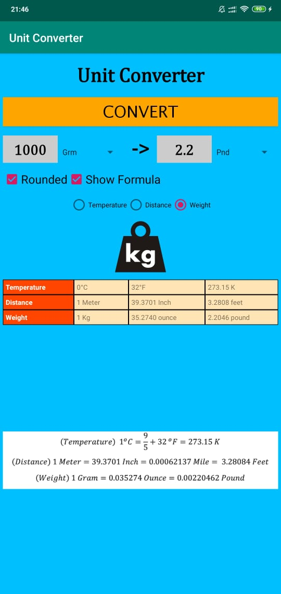

##### 12. Hasil run Distance
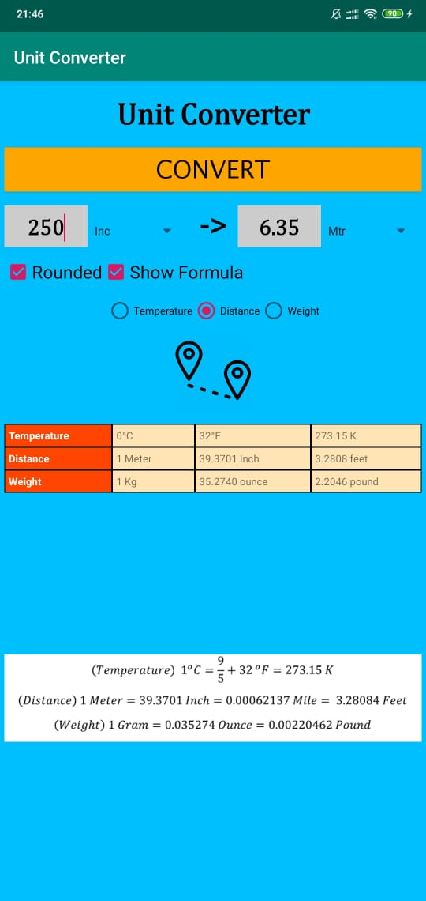
