# 04 - Advanced Widgets

## Tujuan Pembelajaran

1. Mahasiswa mampu memahami konsep penggunaan View Model pada aplikasi Android
2. Mahasiswa mampu memahami konsep penggunaan Live Data pada aplikasi Android
3. Mahasiswa mampu menerapkan konsep ViewModel pada aplikasi Android
4. Mahasiswa mampu menerapkan konsep LiveData pada aplikasi Android

## Hasil Praktikum

##### 1.Task B2X.011

##### Task B2X.012
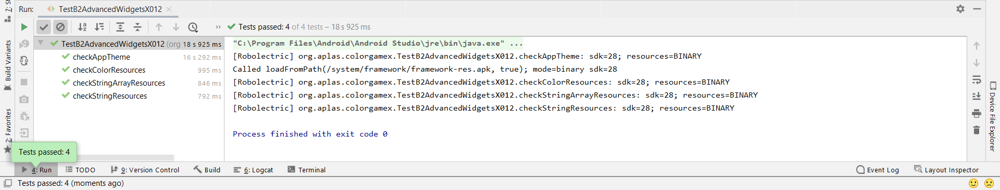

##### 2.Task B2X.021
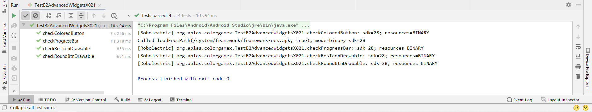

##### 3.Task B2X.031
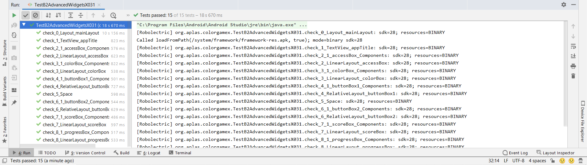

##### 4.Task B2X.041
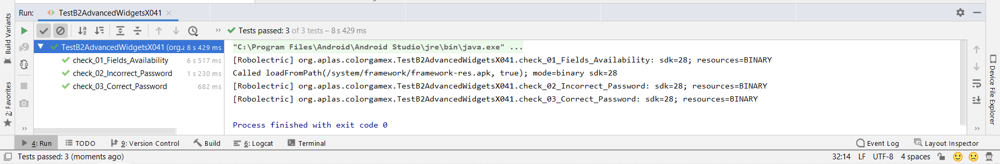
##### RUN APP
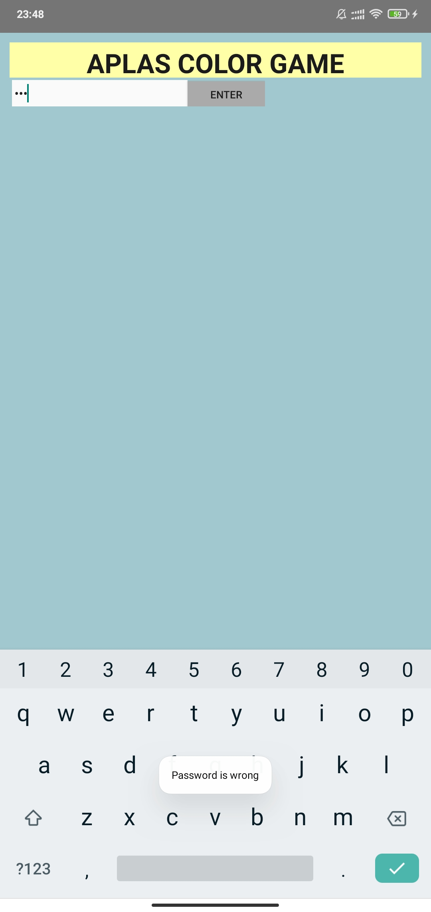
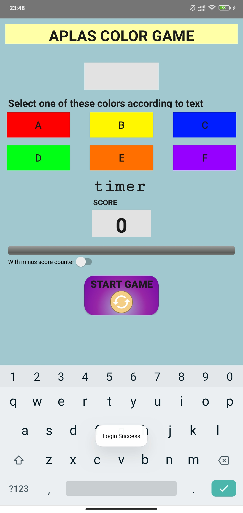

##### 5.Task B2X.051
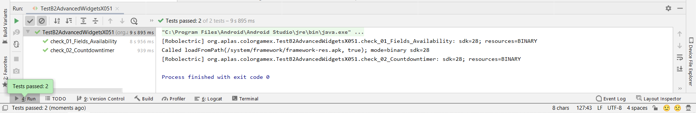

##### 6.Task B2X.061
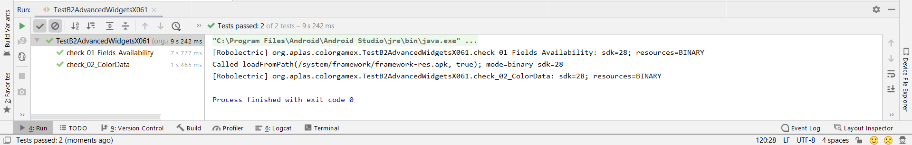

##### 7.Task B2X.071
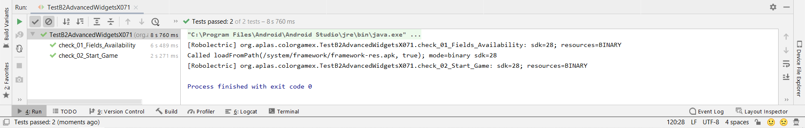
##### RUN APP
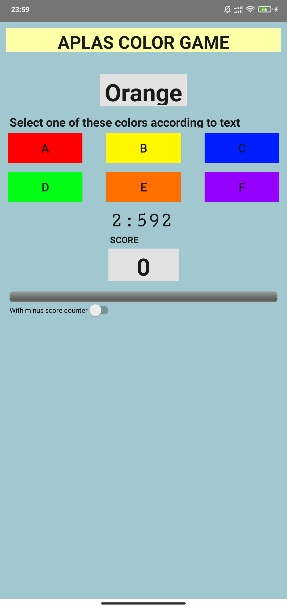

##### 8.Task B2X.081
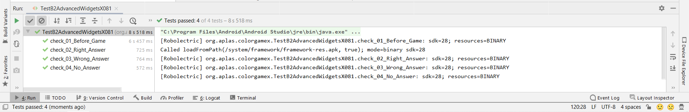

