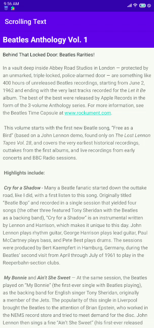
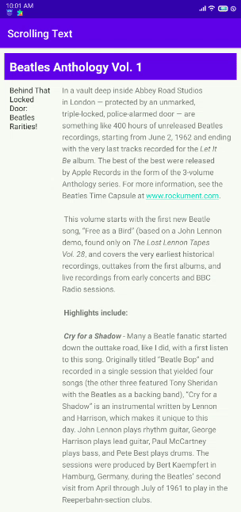

# 05 - Scroll View

## Keterangan Project
Codelabs Google : [here!](https://codelabs.developers.google.com/codelabs/android-training-text-and-scrolling-views/index.html?index=..%2F..%2Fandroid-training#0)
1. How to use XML code to add multiple TextView elements.
2. How to use XML code to define a scrolling View.
3. How to display free-form text with some HTML formatting tags.
4. How to style the TextView background color and text color.
5. How to include a web link in the text.

## Hasil Praktikum

### 1. Codelabs

### 2. Challenge

### 3. Homework
* Question 1 : How many views can you use within a ScrollView? 
	* Answer : One view or one view group
* Question 2 : Which XML attribute do you use in a LinearLayout to show views side by side?
	* Answer : android:orientation="horizontal"
* Question 3 : Which XML attribute do you use to define the width of the LinearLayout inside the scrolling view?
	* Answer : android:layout_width="match_parent"

