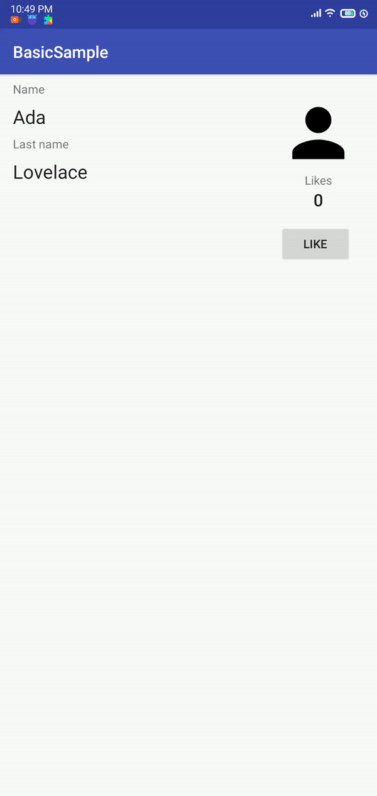

# 09 - Data Binding

## Tujuan Pembelajaran

1. The Data Binding Library is an Android Jetpack library that allows you to bind UI components in your XML layouts to data sources in your app using a declarative format rather than programmatically, reducing boilerplate code.

## Hasil Praktikum

