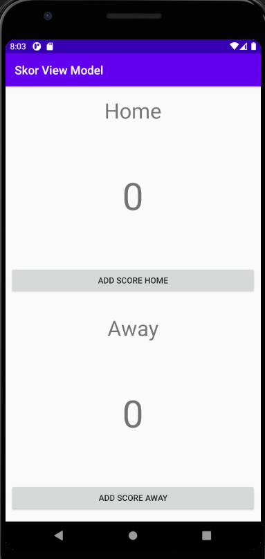
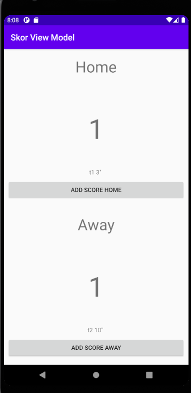

# 10 - View Model

## Tujuan Pembelajaran

1. Mahasiswa mengenal tentang arsitektur MVVM.
2. Mahasiswa memahami lifecycle viewmodel pada MVVM.
3. Mahasiswa mampu menerapkan viewmodel pada Android.

## Hasil Praktikum

