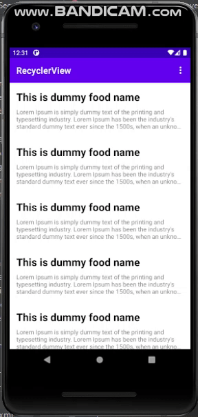

# 12 - Recyclerview

## Tujuan Pembelajaran

1. Mahasiswa mampu menambahkan Recycler View pada aplikasi android.
2. Mahasiswa mampu menampilkan data sederhana dengan RecyclerView.
3. Mahasiswa mampu menerapkan Recycling ViewHolders
4. Mahasiswa mampu menambahkan Data Binding ke Adapter

## Hasil Praktikum

- Question 1 : Which of the following statements about a RecyclerView is false? 
- Answer 1 : You don't need a layout manager with a RecyclerView to handle the hierarchy and layout of View elements
- Question 2 : Which of the following is the primary component you need to provide to an adapter a View item and its position within a RecyclerView?
- Answer 2 : RecyclerView.ViewHolder
- Question 3 : Which interface do you need to implement in order to listen and respond to user clicks in a RecyclerView?
- Answer 3 : View.onClickListener

