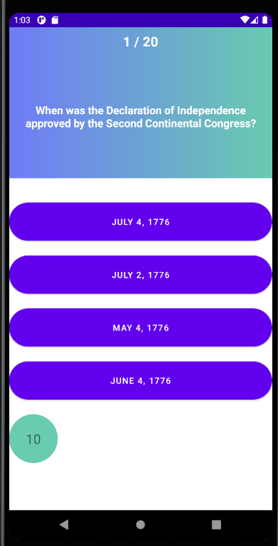

# 12 - Retrofit

## Tujuan Pembelajaran

1. Mahasiswa mampu mengonfigurasi Retrofit pada android.
2. Mahasiswa mampu membuat request ke RESTful API menggunakan Retrofit.

## Hasil Praktikum

1. Tambahkan inputan dari user agar dapat mengganti username secara dinamis!
2. Tambahkan tampilan loading atau progress bar ketika sedang proses request ke REST API!
3. Berikan cara memberitahukan kepada user jika gagal request ke REST API selain menggunakan Toast!

