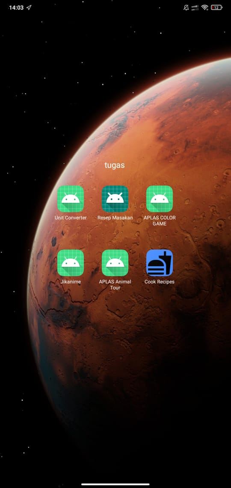
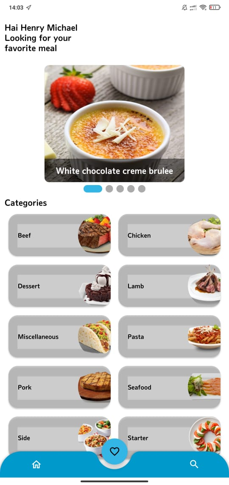
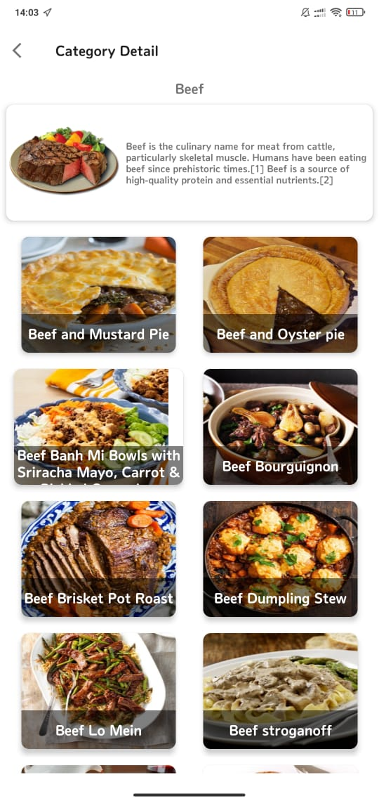
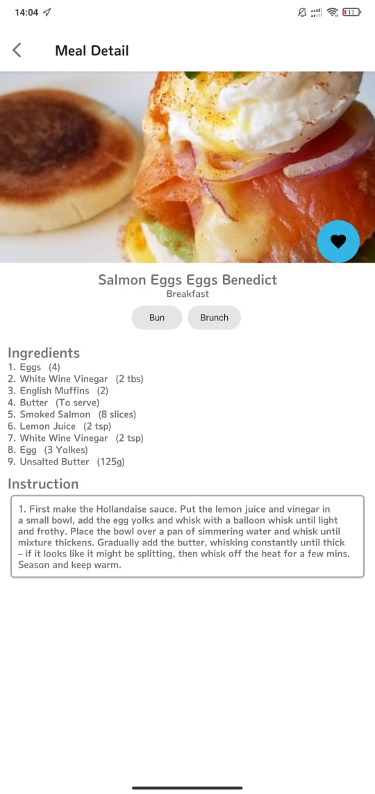
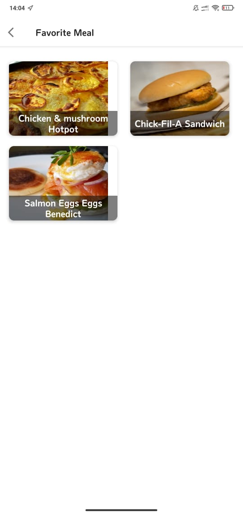
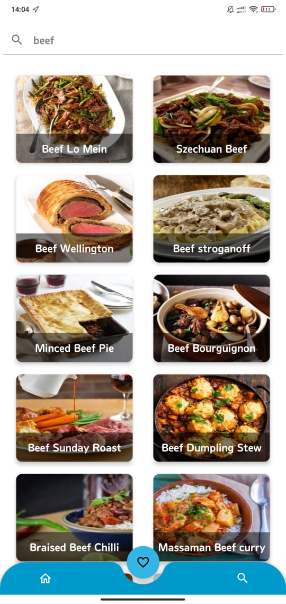

# Pemrograman Mobile

|  |  |
|--|--|
| Dosen Pengampu | [Habibie Ed Dien, S.Kom., M.T.](https://github.com/hbb-polinema) |
| Tahun Ajaran | Ganjil 2020/2021 |
| Email | habibie@polinema.ac.id |
| Institusi | jti.polinema.ac.id |

## Judul/Nama Aplikasi

|  |  |
|--|--|
| Nama Aplikasi | **Cook Recipes** |
| Link Source Code | https://github.com/henrymic0408/mobile-3e-17/tree/main/src/13_ProjectAkhir |
| Bahasa Pemrograman | **Java** |

## Deskripsi Aplikasi

Penggunaan device berbasis Android dari tahun ke tahun mengalami peningkatan yang sangat pesat. Salah satu contohnya adalah aplikasi pada bidang kuliner. Makanan merupakan hal yang bisa dikatakan sangat penting dalam kehidupan sehari-hari, namun faktanya banyak orang di Indonesia tidak bisa memasak.
Dengan aplikasi Cook Recipes ini dapat membantu segala kalangan baik dari yang muda hingga tua, pria ataupun wanita dapat memasak karena sudah tersedia dalam aplikasi Cook Recipes bahan-bahan yang dibutuhkan dan intruksi untuk memasaknya.
Cook Recipes ini menggunakan API dari https://www.themealdb.com/ untuk mendapatkan data dari resep makanan.

## Data Diri Pengembang (Developer)

|  |  |
|--|--|
| NIM | **1841720124** |
| Nama Lengkap | **Henry Michael Suryanto** |
| Kelas | **TI-3E** |

## Fitur-fitur Aplikasi

|  |  |  |
|--|--|--|
| Icon Launcher  | Memberikan tampilan pada icon aplikasi agar terlihat lebih menarik. (Icon aplikasi Cook Recipes memiliki background berwarna biru dan logo makanan) |  |
| Menu Home | Pada menu home ini bagian paling atas terdapat text view menunjukan nama saya Henry Michael, lalu selanjutnya dibawahnya ada widget NestedScrollView dan diberikan fungsi random sehingga saat aplikasi ditutup dan dibuka kembali menu yang tampil pada NestedScrollView berbeda-beda,lalu dibawahnya lagi terdapat Categories dari menu makanan, dan dibagian paling bawah terdapat Navigation Home, Favorite dan Search |  |
| Category Detail | Dibagian Category Detail terdapat menu makanan yang bisa dipilih |  |
| Meat Detail | Dibagian ini terdapat detail dari sebuah menu, Berisi bahan bahan yang dibutuhkan untuk memasak dan intruksi bagaimana cara memasaknya, dan didekat gambar terdapat tombol love yang berfungsi untuk menambahkan menu makanan tersebut menjadi Favorite Meal |  |
| Favorite Meal | Menu makanan yang ditambahkan menjadi favorite meal dapat dilihat pada halaman ini |  |
| Search | Pada Navigation search ini kita dapat mencari menu secara spesifik yang kita inginkan |  |

## Saran

- Aplikasi Cook Recipes diharapkan dapat diberikan Splash Screen untuk meningkatkan tampilan agar semakin menarik
- Aplikasi Cook Recipes diharapkan dapat ditambahkan fitur share yang berfungsi untuk share resep makanan ke berbagai sosial media
- Aplikasi Cook Recipes diharapkan dapat ditambahkan fitur fresh recipes sehingga saat ada resep terbaru dapat dimunculkan pada halaman fresh recipes

## Kesimpulan
- Mempelajari menggunakan API
- Mempelajari cara kerja recycleview
- Mempelajari cara kerja navigation
- Mempalajari cara kerja fungsi Random

## Refrensi

| Nama Fitur | Link Source Code / Refrensi |
|--|--|
| Icon Launcher | https://developer.android.com/studio/write/image-asset-studio?hl=id |
| Recycle View | https://developer.android.com/codelabs/android-training-create-recycler-view#3 |
| Text View | https://developer.android.com/reference/kotlin/android/widget/TextView |
| Navigation | https://codelabs.developers.google.com/codelabs/android-navigation#0 |
| API | https://developer.android.com/codelabs/advanced-android-training-places-api#0 |
| NestedScrollView | https://codelabs.developers.google.com/codelabs/mdc-104-java#0 |
| DotsIndicator | https://medium.com/droid-log/android-dots-indicator-a093d9dc3f5f |